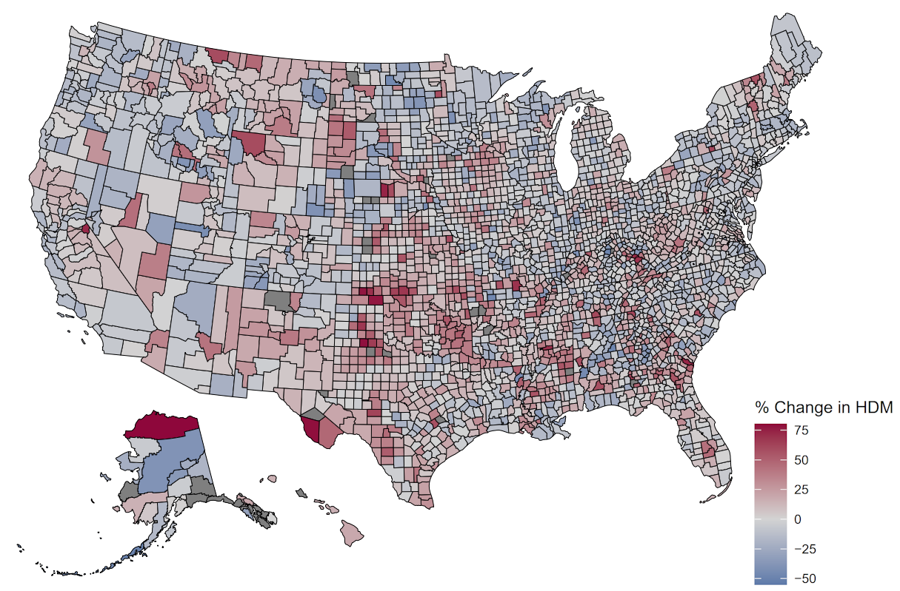

:::{#trest-heading}
## Hello!
I'm a master's student in computational biology at Carnegie Mellon University! I'm on a mission to utilize multi-modal biological data like -omics, images, and test results to inform diagnosis, predict treatment and prognosis heterogeneity, and hopefully catch diseases before they occur.

In my data science BS at West Virginia University, I was involved in [public health insurance analysis](https://github.com/gradyking/ACA-Research), analyzing human nasal swab samples for [viral variants](https://github.com/gradyking/stoilov-viral-variants), and learning about the role of RNA-binding proteins in mouse photoreceptors in my [capstone](https://github.com/gradyking/capstone). I also learned the basics of many human diseases in my molecular medicine minor, and rigorous design of experiments and regression analysis in my statistics minor!

Check out my CV [here](https://docs.google.com/viewer?url=https://raw.githubusercontent.com/gradyking/gradyking/refs/heads/main/Grady%20King%20Current%20CV.pdf)! If you'd like to reach me, check my GitHub page on the left.

Outside of academics, I love to climb, cook, read, jam out to music, learn about the world, and eat new and increasingly spicy foods!

:::

## Papers {#papers}
[**Impact of the Medicaid expansions on heart disease mortality**](https://doi.org/10.1111/ecaf.12685){.paper-link} (2025). *Economic Affairs* 45:1, 78-91  
[With [Dr. Srinivas Palanki](https://srinivaspalanki.faculty.wvu.edu)]{.coauthor}  
[Code](https://github.com/gradyking/ACA-Research); [Poster](https://docs.google.com/viewer?url=https://raw.githubusercontent.com/gradyking/ACA-Research/refs/heads/main/poster/Summer%202023%20Poster.pdf)

::: {.callout-note collapse="false"}
## Summary

<!-- 

  

 -->

::: {.float-right}
{.lightbox width=250px}
:::

- **Goal:** Did the Affordable Care Act prevent deaths?
- Medicaid covers low-income Americans, but was different state-by-state
- Affordable Care Act wanted to cover everyone under 138% of the federal poverty line (FPL) with Medicaid
- [Supreme Court](https://www.oyez.org/cases/2011/11-393) ruled that states can choose to expand Medicaid or not -> two comparison groups
- Looked at "preventable" heart disease deaths, meaning deaths designated by the CDC to be very deadly without treatment, but not deadly with treatment
- Found significant decrease in heart disease mortality
- A reduction in heart disease mortality in non-expansion states similar to expansion states would have prevented **~14,600 deaths over 10 years**.
:::

## Research Summary

  <iframe src="researchSummary.pdf" style="position: absolute; top: 0; left: 0; width: 100%; height: 100%;" frameborder="0"></iframe>

